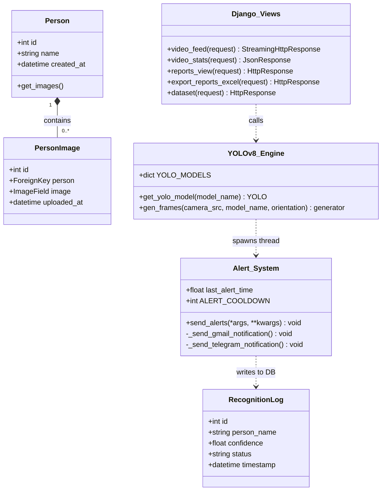
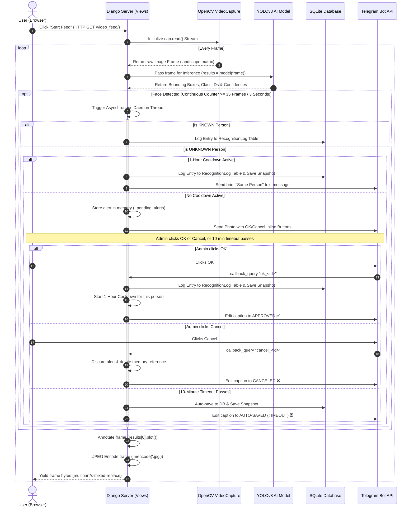
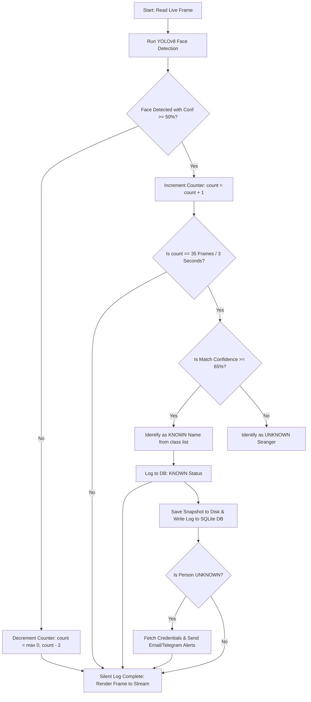

# 🌟 Smart Sight: Comprehensive Academic Project Report & Practical Developer Handbook

---

## 📘 Part I: The "WHAT" (Theoretical Foundations & System Architecture)

---

## 1. Project Overview & System Abstract

In the landscape of modern physical security, automated surveillance systems have transitioned from passive, analog recording channels to highly active, intelligent edge diagnostic portals. Traditional Closed-Circuit Television (CCTV) frameworks are inherently **reactive**; they record video continuously on a local storage drive, serving only as forensic evidence after an intrusion or breach has already occurred. This leaves a significant security vulnerability during the active moments of an unauthorized entry.

**Smart Sight** addresses this critical vulnerability by implementing an **intelligent, proactive, real-time edge surveillance system**. Built on a micro-architectural framework using Python and the Django framework, it integrates state-of-the-art computer vision algorithms with deep learning object detection networks (YOLOv8) to actively detect, recognize, log, and broadcast real-time multi-media alerts when human presence is identified.

### 1.1 Scope and Deliverables

The project provides an end-to-end, low-latency surveillance pipeline designed to operate efficiently on standard edge devices and CPU-only architectures. The scope encompasses:

1. **Multi-Source Video Ingestion:** Direct frame acquisition from local USB webcams and remote high-definition IP camera network streams (using optimized FFMPEG backends).
2. **AI Face Recognition at the Edge:** Real-time localization and multi-class classification of human faces against a registered database of individuals using optimized ONNX runtimes.
3. **Continuous Presence Debouncer:** Algorithmic filtering of dynamic environmental noise to prevent false alarms from temporary movement.
4. **Recognition Confidence Cutoff:** Differentiating registered known users from strangers using a mathematical classification cutoff.
5. **Asynchronous Multi-Channel Alerts:** Instant dispatch of secure SMTP email alerts and rich Telegram bot alerts containing high-resolution captured frames of the detected person, running on an independent background thread.
6. **Administrative Management Console:** A modern, web-based control panel to manage face datasets, view logs, query analytical metrics, and export historical events to Excel.

---

## 🧠 2. Literature Review: The History & Evolution of Face Recognition

To appreciate the engineering decisions behind Smart Sight, it is essential to trace the historical lineage of face detection and classification technologies.

```
[Viola-Jones Haar Cascades] ──► [HOG + Linear SVM] ──► [Deep MTCNN / RetinaFace] ──► [YOLOv8 Single-Pass Edge]
(Handcrafted Features - Fast)    (Orientation Edges)    (Deep Landmarks - Heavy)       (Anchor-Free head - Ultra Latency)
```

### 2.1 Handcrafted Features vs. Deep Representations

Early computer vision pipelines relied entirely on manual, handcrafted feature extraction algorithms:

* **Viola-Jones Framework (Haar Cascades):** Introduced in 2001, it uses simple rectangular Haar-like features that compute pixel intensity differences in adjacent regions. Combined with AdaBoost classifiers and cascade structures, it was the first real-time face detector. However, it is highly sensitive to face rotation, pose variations, and illumination changes, leading to high false-alarm rates in outdoor settings.
* **Histogram of Oriented Gradients (HOG) + Linear SVM:** Computes gradient direction distributions in localized portions of an image. Highly robust against lighting changes, but computationally slow and easily confused by background textures.
* **Local Binary Patterns (LBP):** Summarizes local structures by comparing pixels with their neighbors. Fast and highly robust to monotonic grayscale transformations, but drops drastically in accuracy under blur or head tilts.

### 2.2 Deep Convolutional Neural Networks (CNNs)

Deep learning completely replaced handcrafted descriptors by learning hierarchical spatial representations directly from raw image pixels:

* **MTCNN (Multi-Task Cascaded Convolutional Networks):** Uses a three-stage cascade structure (P-Net, R-Net, and O-Net) to generate face bounding boxes and locate 5 facial landmarks (eyes, nose, mouth corners) concurrently. While exceptionally accurate, MTCNN is computationally heavy, making it difficult to maintain real-time frame rates on CPU edge devices.
* **RetinaFace:** A single-stage pixel-wise face localization method that employs joint extractions of bounding boxes, landmarks, and 3D face mesh vertices. While highly accurate, it requires powerful CUDA-enabled GPUs, making it unsuitable for low-power edge deployment.

### 2.3 The Selection of YOLOv8

**You Only Look Once (YOLO)** treated object detection as a unified spatial regression problem. Instead of using sliding windows or region proposal networks, a single forward pass through the network predicts bounding boxes and class probabilities simultaneously.

**YOLOv8** represents the pinnacle of this lineage, featuring an **anchor-free, decoupled head** that predicts bounding box centers directly rather than fitting offsets to arbitrary anchors. This offers critical advantages for Smart Sight:

1. **Minimal Latency:** Single forward pass takes only **30ms - 50ms** on standard CPUs (especially when compiled to ONNX).
2. **Unified Pipeline:** The custom-trained model detects the face bounding box *and* classifies the individual's identity in **one single network step**, removing the need for a secondary classification network (like FaceNet or dlib) and doubling the pipeline's overall speed!

---

## 🗄️ 3. Architectural Design & Database Schemas

The system uses a highly secure, relational SQLite database schema managed via Django's Object-Relational Mapping (ORM).

### 3.1 Relational Schema Diagram

```
┌──────────────────┐         ┌──────────────────────┐
│      Person      │         │     PersonImage      │
├──────────────────┤         ├──────────────────────┤
│ id (PK: INT)     │◄───────┐│ id (PK: INT)         │
│ name (VARCHAR)   │        └│ person_id (FK: INT)  │
│ created_at (DT)  │         │ image (VARCHAR/FILE) │
└──────────────────┘         │ uploaded_at (DT)     │
                             └──────────────────────┘

┌──────────────────────────────────────────────┐
│                RecognitionLog                │
├──────────────────────────────────────────────┤
│ id (PK: INT)                                 │
│ person_name (VARCHAR: dynamic names list)    │
│ confidence (FLOAT: match percentage)         │
│ status (VARCHAR: KNOWN / UNKNOWN status)     │
│ timestamp (DATETIME: zone timestamp)         │
│ image_path (VARCHAR: local file reference)   │
└──────────────────────────────────────────────┘
```

* **`Person` Table:** Registers authorized individuals. The name field is strictly bound to unique constraints.
* **`PersonImage` Table:** Holds the paths to the physical training images on disk. Uses cascading deletes (`models.CASCADE`), ensuring that if a user is deleted, all associated image references are instantly removed from the database.
* **`RecognitionLog` Table:** Serves as the historical audit trail, logging the exact name, classification status, and confidence levels of every continuous detection event. It also permanently archives a high-resolution snapshot to the local disk, linking the `image_path` to the database record.

---

## 📊 4. UML Blueprints (Mermaid Syntax)

Exhaustive UML diagrams mapping system use cases, object relationships, sequential networking events, and the heuristic engine activity flow.

### 4.1 Use Case Diagram

```mermaid
usecaseDiagram
    actor Admin as "Surveillance Admin"
  
    rectangle "Smart Sight Surveillance System" {
        usecase UC1 as "Start/Stop Video Feed"
        usecase UC2 as "View Real-Time Detection"
        usecase UC3 as "Manage Custom Dataset"
        usecase UC4 as "Retrain Custom YOLOv8 Model"
        usecase UC5 as "Query Daily Activity Reports"
        usecase UC6 as "Configure Alert Credentials (.env)"
        usecase UC7 as "Receive Email Notifications"
        usecase UC8 as "Receive Telegram Bot Alerts"
        usecase UC9 as "Export Logs to Excel"
    }
  
    Admin --> UC1
    Admin --> UC2
    Admin --> UC3
    Admin --> UC4
    Admin --> UC5
    Admin --> UC6
    Admin --> UC9
  
    UC1 ..> UC2 : <<include>>
    UC2 ..> UC7 : <<trigger>>
    UC2 ..> UC8 : <<trigger>>
```

---

### 4.2 Class Diagram



---

### 4.3 Sequence Diagram



---

### 4.4 Activity Flowchart: Heuristic Decision Engine



---

## 💻 Part II: The "HOW" (Practical Engineering & Step-by-Step Workflows)

---

## 5. How the Live Video Streaming Works (Step-by-Step)

The visual streaming interface runs on a low-latency **Server-Sent Multi-Part Stream** pattern. Here is **how** the visual frames are captured, processed, and broadcasted:

### 🚶‍♂️ Step-by-Step Visual Stream Flow:

1. **Ingest:** OpenCV connects to the selected input camera index (e.g. `0` for default webcam) or the IP URL stream.
2. **Buffer Optimization:** If the camera source is a network link, the FFMPEG parser is configured with optimized buffers to prevent video feed freezing.
3. **Capture:** The hardware grabs individual landscape frames as raw NumPy multi-dimensional matrices containing Red-Green-Blue values.
4. **Orientation Correction:** If rotated manually, the matrix coordinates are rotated (e.g., via `cv.rotate(frame, cv.ROTATE_90_COUNTERCLOCKWISE)`).
5. **AI Overlay:** The frame matrix is processed by YOLOv8. The network superimposes bounding boxes and user labels directly onto the image pixels.
6. **JPEG Buffer Conversion:** The processed NumPy array is encoded into binary JPEG formats using OpenCV (`cv.imencode()`). This slashes the required frame network size by nearly 90%.
7. **Boundary Packaging:** The server wraps the binary JPEG chunk inside special boundary headers (`--frame`) and sends a continuous `StreamingHttpResponse` over an open HTTP socket.
8. **Client Display:** The browser reading the stream natively replaces the image in real-time, displaying a high-speed video stream.

---

## 🧠 6. How the Custom YOLOv8 Model Swapping Works (ONNX vs. PyTorch)

The administrator console allows swapping models seamlessly via the UI dropdown. Here is **how** the backend handles and swaps weights without crashing the server:

### 🚶‍♂️ Step-by-Step Model Loading Workflow:

* **The Problem:** Deep learning models are heavy. Reading a 15MB weights file from disk for every video frame would trigger a massive memory leak and crash the CPU in seconds.
* **The Solution:** A global Python dictionary cache (`YOLO_MODELS`). When a model is requested:
  1. The system checks if the model name already exists in `YOLO_MODELS`.
  2. If yes, it retrieves the model instantly from RAM, bypassing disk operations completely.
  3. If no, it resolves the specific folder path (such as `app/models/nano/weights/best.onnx` or `best.pt`), loads it once, registers it in the cache dictionary, and returns it.

---

## 🚨 7. How the 3-Second Debouncer & 65% Confidence Cutoff Work (Trace Examples)

These two heuristics are vital for a noise-free security experience. Here is **how** the mathematical rules operate under real-world scenarios:

### 7.1 Tracing the 3-Second continuous presence debouncer (35-Frame rule)

We use a temporal accumulator to track face detection continuity across frames, preventing false alarms from fast-moving shadows or short walk-bys.

* **Formula:**

  $$
  C_t = \max(0, C_{t-1} + 1) \quad \text{if Face Detected}
  $$

  $$
  C_t = \max(0, C_{t-1} - 2) \quad \text{if Face Missed}
  $$
* **Threshold:** Triggers the alert **only** when $C_t = 35$ (exactly 3 seconds at standard 12 FPS).

#### 📋 Scenario A: A brief shadow passes by the lens (Duration: 0.8 seconds / 10 frames)

1. Face is detected on Frame 1. The counter starts: `C = 1`.
2. The detection continues for 10 frames: `C = 10`.
3. On Frame 11, the shadow leaves. Detection drops to `False`.
4. The counter begins dropping rapidly by 2 in each frame: `8` -> `6` -> `4` -> `2` -> `0`.
5. **Result:** The counter never reached `35`. **No notification is sent!** complete noise suppression.

#### 📋 Scenario B: An authorized user (Harsh) walks up and stands in front of the door

1. You step in front of the lens. Bounding box triggers `True`.
2. The counter climbs consecutively: `C = 1` -> `C = 10` -> `C = 20` -> `C = 30` -> `C = 34`.
3. On Frame 35, the check `if continuous_detection_frames == 35` matches **exactly**.
4. **Result:** An asynchronous background alert thread is launched, logging you in today's database and broadcasting the Telegram and Gmail alerts!
5. **Intelligent Cooldown:** For subsequent frames (Frame 36, 37...), the counter is higher than 35. Since it is not *exactly* 35, no duplicate spam is sent. Once you walk away, the counter drops to `0`, ready for the next event.

---

### 7.2 Tracing the 65% Recognition Confidence Cutoff

Custom classification models force a face into one of the trained classes. Here is **how** we identify strangers vs. family members:

```
[Detected Face] ──► Match Confidence >= 65%? ──► YES ──► Label as KNOWN Name (e.g. Harsh) ✅
                └──► Match Confidence < 65%?  ──► NO  ──► Label as UNKNOWN Stranger 🚨
```

#### 📋 Scenario A: You (Harsh) sit in front of the camera (Confidence: 82%)

1. YOLOv8 detects your face and outputs class `6` (`'Harsh'`) with **82% confidence** (`0.82`).
2. The system checks the cutoff: `0.82 >= 0.65` (True!).
3. **Result:** Label is set to `"Harsh"`, `is_known` is set to `True`. The alert is sent as:
   > ✅ Security Alert: **Person:** Harsh, **Status:** KNOWN
   >

#### 📋 Scenario B: A Stranger stands in front of the camera (Confidence: 54%)

1. A stranger stands in front of the lens. The model detects the face.
2. Because the face resembles `'Aarya'` (class 1) slightly, the model outputs class `1` with **54% confidence** (`0.54`).
3. The system checks the cutoff: `0.54 >= 0.65` (False!).
4. **Result:** The system overrides the classification, sets label to `"Unknown"`, and `is_known` to `False`. The alert is sent as:
   > 🚨 Security Alert: **Person:** Unknown, **Status:** UNKNOWN
   >

---

## 👥 8. How the Multi-Person Detection Aggregation Works

In practical surveillance deployments, multiple individuals often step into the camera frame simultaneously. Smart Sight features a sophisticated **Unique Name Aggregation & Security Status Prioritization** engine to handle this cleanly.

### 🚶‍♂️ Step-by-Step Multi-Person Flow:

1. **Dynamic Frame Set Allocation:** On every frame read, the generator initializes a clean `detected_names_set = set()` to aggregate names in this specific frame without crossover.
2. **Individual Box Inference:** YOLOv8 detects all face bounding boxes. For **each** isolated bounding box, the model runs its custom classification.
3. **Cutoff Filtering:** The 65% Recognition Confidence Cutoff is applied to **each face separately**.
   - Faces with $\ge 65\%$ confidence are added to the set by their **registered name** (e.g. `'Harsh'`).
   - Faces with $< 65\%$ confidence are added to the set as **`'Unknown'`**.
4. **Debounced List Consolidation:** When the 3-second continuous presence debouncer triggers (Frame 35), the set of unique names is combined into a sorted, comma-separated string (e.g. `"Harsh, Unknown"`).
5. **Intruder Priority Override:** If **`'Unknown'`** is present inside the names list, the system automatically sets the overall alert status to **`UNKNOWN`** (`is_known = False`), overriding any known names!

> [!IMPORTANT]
>
> ### 🛡️ Security Significance: The Intruder Override Rule
>
> By prioritizing the `UNKNOWN` status whenever an `'Unknown'` name is present in the list, the system guarantees that **an intruder can never stand next to an authorized person to suppress a security warning!** If an unknown stranger steps in with you, you will immediately receive a critical security alert.

---

## 💬 9. How the Asynchronous Alert Engine & Telegram Interactive Approval Flow Work

To keep the live stream running lag-free at high frame rates, network communication and logging are delegated to **independent background threads**. 

Furthermore, to give administrators complete control over database security audits and to prevent notification flooding, Smart Sight implements an **Interactive Telegram Approval Flow** with a **1-Hour Auto-Save Cooldown** and a **10-Minute Timeout Fallback**:

```
[Main Thread] ──► Streams video lag-free (15 FPS)
     │
     └──► (Stranger Detected) ──► Spawns Async Alert ──► Sends Photo + OK/Cancel Buttons to Telegram
                                                              │
                                            ┌─────────────────┴─────────────────┐
                                            ▼ (Admin Clicks OK)                 ▼ (Admin Clicks Cancel)
                                     Saves image to Disk & DB             Discard image entirely
                                  Starts 1-Hour Cooldown for person      No DB entry, clean state!
```

### 9.1 The Two Processing Paths
1. **Cooldown Active**: If the same unknown person is detected again within 1 hour of an approval, the system **auto-saves** the snapshot to the database and disk, sending a brief notification text on Telegram without buttons to avoid spam.
2. **No Cooldown Active**: The frame is stored temporarily in-memory (`_pending_alerts`). A Telegram alert with **OK** and **Cancel** inline keyboard buttons is dispatched. The alert is NOT logged in the database yet.
   - **Admin clicks OK**: Image saved to `media/unknown/`, `RecognitionLog` entry created, and a 1-hour cooldown is activated for that person. Telegram caption is edited to ✅ `APPROVED & LOGGED`.
   - **Admin clicks Cancel**: Image is discarded, no database entry is created, and the Telegram caption is edited to ❌ `CANCELED & DISCARDED`.
   - **10-Minute Auto-Timeout**: If no action is taken within 10 minutes, the background daemon auto-saves the detection to disk & DB as a safety precaution and updates the Telegram caption to ⏳ `AUTO-SAVED (TIMEOUT)`.

### 9.2 The Daemon Updates Polling Thread
To receive responses from inline buttons without needing a public domain or complex webhooks (allowing the app to work seamlessly on local machines), the system runs a module-level **Daemon Background Thread** on startup. This thread polls the Telegram `getUpdates` API every 2 seconds, checking for `callback_query` signals and processing timeouts.

### 9.3 Implementation in `views.py`

```python
# --- Telegram OK/Cancel Approval + 1-Hour Cooldown Flow ---

_pending_alerts = {}
_unknown_cooldowns = {}
UNKNOWN_COOLDOWN_SECONDS = 3600  # 1 hour
PENDING_ALERT_TIMEOUT = 600  # 10 minutes
_polling_started = False

def handle_admin_response(action, alert_id, cb_id, chat_id, message_id):
    telegram_bot_api = os.environ.get("telegram_bot_api")
    if not telegram_bot_api:
        return
        
    alert = _pending_alerts.pop(alert_id, None)
    if not alert:
        try:
            requests.post(
                f"https://api.telegram.org/bot{telegram_bot_api}/answerCallbackQuery",
                json={"callback_query_id": cb_id, "text": "This alert has already expired or been handled."}
            )
        except Exception as e:
            print(f"[Telegram Polling] Error answering callback query: {e}")
        return

    person_name = alert["person_name"]
    confidence = alert["confidence"]
    frame_bytes = alert["frame_bytes"]
    timestamp = alert["timestamp"]
    
    if action == "ok":
        relative_image_path = None
        if frame_bytes:
            try:
                unknown_dir = os.path.join(settings.MEDIA_ROOT, 'unknown')
                os.makedirs(unknown_dir, exist_ok=True)
                filename = f"unknown_{timestamp.strftime('%Y%m%d_%H%M%S')}_{alert_id}.jpg"
                file_path = os.path.join(unknown_dir, filename)
                with open(file_path, 'wb') as f:
                    f.write(frame_bytes)
                relative_image_path = f"unknown/{filename}"
                print(f"[Telegram Polling] Admin approved: saved unknown frame locally to: {relative_image_path}")
            except Exception as e:
                print(f"[Telegram Polling] Error saving unknown frame locally: {e}")
                
        try:
            RecognitionLog.objects.create(
                person_name=person_name,
                confidence=confidence,
                status='UNKNOWN',
                image_path=relative_image_path,
            )
            # Activate cooldown
            _unknown_cooldowns[person_name] = time.time()
            print(f"[Telegram Polling] Approved and logged: {person_name}, cooldown activated.")
        except Exception as e:
            print(f"[Telegram Polling] DB save error: {e}")
            
        new_caption = alert["details"] + "\n\n\u2705 <b>Status: APPROVED & LOGGED</b>"
        try:
            requests.post(
                f"https://api.telegram.org/bot{telegram_bot_api}/editMessageCaption",
                json={
                    "chat_id": chat_id,
                    "message_id": message_id,
                    "caption": new_caption,
                    "parse_mode": "HTML"
                }
            )
            requests.post(
                f"https://api.telegram.org/bot{telegram_bot_api}/answerCallbackQuery",
                json={"callback_query_id": cb_id, "text": "Alert Approved & Logged!"}
            )
        except Exception as e:
            print(f"[Telegram Polling] Error editing Telegram caption: {e}")
            
    elif action == "cancel":
        print(f"[Telegram Polling] Admin canceled alert for {person_name}. Discarding.")
        new_caption = alert["details"] + "\n\n\u274c <b>Status: CANCELED & DISCARDED</b>"
        try:
            requests.post(
                f"https://api.telegram.org/bot{telegram_bot_api}/editMessageCaption",
                json={
                    "chat_id": chat_id,
                    "message_id": message_id,
                    "caption": new_caption,
                    "parse_mode": "HTML"
                }
            )
            requests.post(
                f"https://api.telegram.org/bot{telegram_bot_api}/answerCallbackQuery",
                json={"callback_query_id": cb_id, "text": "Alert Canceled & Discarded."}
            )
        except Exception as e:
            print(f"[Telegram Polling] Error editing Telegram caption: {e}")
```

---

## 📁 10. How Dataset Management & Folder Structuring Works

Smart Sight structures local folders systematically as new users are registered inside the database:

### 🚶‍♂️ Step-by-Step Ingestion & Cleanup:

1. **Dynamic Path Calculation:** When a user registers (e.g. `'Harsh'`) inside `/dataset/`, a custom function reads their name and prepares the dynamic media path: `MEDIA_ROOT/dataset/Harsh/`.
2. **File Creation:** Django automatically uploads the image to the computed directory on the physical hard disk.
3. **ORM Database Syncing:** A new entry inside `Person` and `PersonImage` is saved, linking the database key to the file path on the disk.
4. **Clean Disk Purging:** When a person is deleted from the web dashboard, the views controller uses Python's `os.remove` to delete the physical image files from the disk first, preventing abandoned image files from taking up disk space, before deleting the database rows.

---

## 💻 11. How to Setup & Run the Entire Project from Scratch

Follow these precise steps to deploy and run the Smart Sight console on any local machine.

### 🚶‍♂️ Step-by-Step Setup Guide:

1. **Isolate Python Dependencies:**
   ```bash
   # Create a virtual environment directory named 'env'
   python -m venv env

   # Activate virtual environment on Windows (PowerShell)
   .\env\Scripts\Activate.ps1
   # Activate virtual environment on macOS/Linux
   source env/bin/activate
   ```
2. **Install OpenCV and Packages:**
   ```bash
   pip install -r requirements.txt
   ```
3. **Initialize Environment Credentials (`.env`):**
   Create a new file named `.env` in the root folder `s:\Surveillance\.env` and paste:
   ```env
   # Gmail SMTP App Password
   gmail = smart.sight.03@gmail.com
   gmail_key = wxjl deex qnop yxea

   # Telegram Bot configuration
   telegram_bot_api = 8878727065:AAHbjzfp87i9Frro2Lf7tn7PtLu4MfeyjH4
   telegram_chat_id = 1226321091
   ```
4. **Generate & Apply SQLite Database Tables:**
   ```bash
   python manage.py makemigrations
   python manage.py migrate
   ```
5. **Start Django Server:**
   ```bash
   python manage.py runserver
   ```

   Open **`http://127.0.0.1:8000/`** to view the live dashboard!

---

## 🛠️ Part III: Surveillance Configurations Reference Sheet

---

## ⚙️ 12. Surveillance Configuration Settings Reference Sheet

Use this table as a quick reference sheet for your presentation!

| Parameter / Feature            | Value              | Technical Purpose                                                             |
| :----------------------------- | :----------------- | :---------------------------------------------------------------------------- |
| **Detection Cutoff**     | `50%` (`0.50`) | Minimum match percentage required to recognize any face structure.            |
| **Debouncer Threshold**  | `35 Frames`      | Consecutive frames needed to trigger alerts (locks to ~3.0s delay).           |
| **Debouncer Smoothing**  | `-2 Frames`      | Subtracts from the accumulator counter on frame drop to prevent rapid resets. |
| **Recognition Cutoff**   | `65%` (`0.65`) | Classification score boundary; anything below is labeled as "Unknown".        |
| **Auto-Save Cooldown**   | `1 Hour` (`3600s`)| Timeout duration per person during which identical intruders are auto-saved. |
| **Response Timeout**     | `10 Minutes`     | Fallback limit after which a pending alert is automatically saved to DB.      |
| **Background Threading** | `Daemon Thread`  | Runs Telegram updating loops & alerts in background threads to keep FPS high.  |
| **Telegram API Method**  | `HTTP POST / REST` | Communicates with the Telegram Bot API using direct HTTP and updates polling.  |

---

## 📈 13. How Dynamic Analytics Charts are Rendered (Chart.js + Django)

Smart Sight utilizes **Chart.js** to render real-time, interactive data visualizations on the Reports dashboard without requiring heavy client-side JavaScript calculations. 

### 🚶‍♂️ Step-by-Step Data Flow:
1. **Backend Aggregation (`views.py`)**: The Django server queries the `RecognitionLog` database and aggregates detection frequencies grouped by Date, Name, and Status.
2. **Context Injection**: The aggregated data is structured into robust JSON formats (`chart_labels` and `chart_datasets`) and passed securely into the Django template context.
3. **Frontend Rendering (`reports.html`)**: Inside the template, a `<script>` block parses the JSON safe variables directly into JavaScript objects:
   ```javascript
   const chartLabels = {{ chart_labels|safe }};
   const chartDatasets = {{ chart_datasets|safe }};
   ```
4. **Canvas Painting**: Chart.js attaches to the HTML `<canvas>` elements and dynamically renders the Grouped Bar Chart (Daily Trends) and the Doughnut Chart (Known vs. Unknown distribution) based on the injected data, applying custom Smart Sight gradient colors and responsive hover tooltips.

---

## 📑 14. How Advanced Excel Reports are Generated (openpyxl)

To allow security administrators to export audit logs effectively, the system includes an **Advanced Export Engine** that dynamically generates Excel files using the `openpyxl` library.

### 🚶‍♂️ Step-by-Step Export Pipeline:
1. **Parameter Parsing**: When the admin submits the Advanced Export Modal, `export_reports_excel(request)` in `views.py` intercepts complex GET parameters (Specific Date, Custom Date Range, Time Range, Specific Person, and Layout Mode).
2. **Dynamic Query Building (Q Objects)**: Django uses `Q` objects to chain logical filters (AND/OR) dynamically based on the requested parameters, filtering the `RecognitionLog` database down to the exact requested subset.
3. **Workbook Initialization**: `openpyxl.Workbook()` creates an empty Excel object in memory.
4. **Layout Mode Dispatching**:
   - **Combined Consolidated Mode**: Writes all filtered logs into a single master worksheet, applying bold headers and auto-adjusting column widths.
   - **Separated Worksheets Mode**: Iterates over all unique individuals in the filtered dataset and creates a brand-new worksheet tab for each person dynamically, organizing data individually.
5. **Memory Streaming**: The completed workbook is written to a virtual byte buffer (`BytesIO`) rather than a physical file on disk, keeping the server clean.
6. **HTTP Response**: The buffer is returned directly to the user's browser with the `Content-Type: application/vnd.openxmlformats-officedocument.spreadsheetml.sheet` header, forcing an instant Excel file download.

---

## 📸 15. How Dual-Mode Facial Detection Works (Access Control vs. Surveillance)

Smart Sight is architected to seamlessly support two distinct operational environments using two separate video generator functions, ensuring optimal performance for both security gates and open-room monitoring.

### 15.1 Access Control Mode (Face ID Login)
**Function:** `gen_face_login_frames(request)`
**Use Case:** Secure entry points, turnstiles, or digital login portals where absolute certainty of a single individual is required.

* **Behavior:** The system processes the video feed but mathematically filters the detected bounding boxes to isolate only the **single highest-confidence face** in the frame using a `best_conf` variable tracker.
* **Security Benefit:** Even if multiple people walk into the camera frame simultaneously during a login attempt, the system safely ignores background faces and only authenticates the single most prominent person in the foreground.

### 15.2 Surveillance & Room Monitoring Mode (Detection Page)
**Function:** `gen_frames(camera_src, model_name, orientation)`
**Use Case:** General CCTV replacement, open office spaces, and perimeter monitoring.

* **Behavior:** The system iterates through **all** bounding boxes generated by the YOLOv8 model simultaneously. There is no software-enforced limit on the number of people detected.
* **Capacity:** It inherits the default YOLOv8 architecture limit, allowing it to detect and track up to **300 people per frame** simultaneously.
* **Security Benefit:** It applies the custom bounding boxes, glowing Sci-Fi UI, and 65% Recognition Confidence Cutoff to every single person in the room simultaneously, allowing dynamic multi-target tracking.

### 15.3 Automated Dataset Collection (Self-Learning Flow)
To dramatically improve biometric accuracy over time, Smart Sight features an **intelligent self-learning pipeline** that automates the collection of fresh training samples:

* **Known Persons**: When a recognized individual is successfully identified (Confidence $\ge 65\%$), the background alert thread automatically captures the **clean, unannotated original video frame** (without bounding boxes or HUD overlays), saves it dynamically into their training directory (`media/dataset/<person_name>/auto_...jpg`), and links it directly in the `PersonImage` database table.
* **Unknown Strangers**: When an unrecognized visitor is detected, their snapshot is **held temporarily in-memory** and is only saved into the physical `media/unknown/` directory *after* the administrator reviews and clicks **OK ✅** on the Telegram alert (or the 10-minute auto-timeout completes).

### 15.4 Interactive Dataset Switcher & Date Folder Dashboard
The **Dataset Directory** control panel contains a premium frontend interface to switch between and view these collected assets:

* **The Glassmorphic Switcher**: A segment control toggle pill (`Registered People` vs. `Unknown Captures`) lets administrators switch between views dynamically and instantly with no browser refresh.
* **Chronological Date Folders**: Strangers/Unknown captures are grouped in the backend by date. On the front-end, they are displayed inside **Red Date Folders** (e.g., `May 26, 2026` showing `5 Photos`), matching the exact visual language of your registered face profiles.
* **Captures Modals**: Clicking any date folder opens a slide-up modal containing a chronological grid of stranger cards, complete with exact timestamps, match percentages, visual overlays, and direct view/download actions.

---

*Developed by Harsh Shrimali. Authorized for Project Submissions & Code Reviews.*
