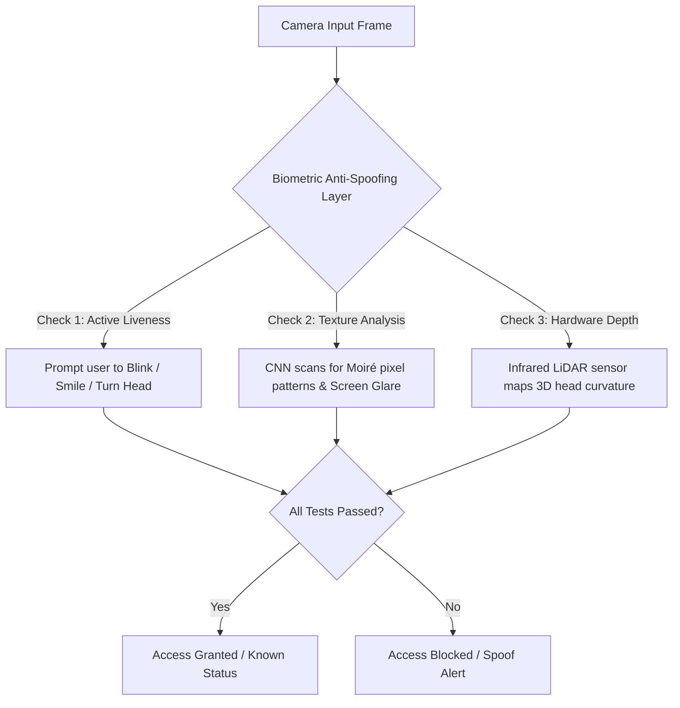
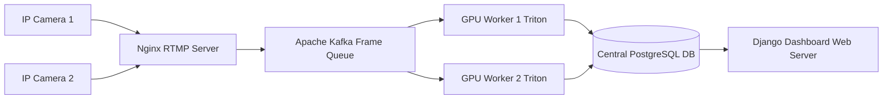

# 🎓 Smart Sight: Ultimate Academic Project Viva & Presentation Handbook

This handbook contains a highly exhaustive, professional collection of **probable Viva Voce and Project Presentation questions** for the **Smart Sight** real-time face-recognition surveillance system. It is specifically designed to help **Harsh Shrimali** present this project to external examiners and academic panels with absolute confidence and master-class engineering expertise!

---

## 📋 Table of Contents
1. [System & Web Architecture (Django, SQLite, Template UI)](#-1-system--web-architecture-django-sqlite-template-ui)
2. [Deep Learning, Neural Network Training & ONNX Engine (YOLOv8 & Optimization)](#-2-deep-learning-neural-network-training--onnx-engine-yolov8--optimization)
3. [OpenCV, Video Streaming & Network Capture Engineering](#-3-opencv-video-streaming--network-capture-engineering)
4. [Intelligent Decision Heuristics & Multi-Person Logic (Continuity & Cutoffs)](#-4-intelligent-decision-heuristics--multi-person-logic-continuity--cutoffs)
5. [Asynchronous Infrastructure & Notification Pipelines (Threads, SMTP, Telegram)](#-5-asynchronous-infrastructure--notification-pipelines-threads-smtp-telegram)
6. [Biometrics, Security, Anti-Spoofing & Enterprise Scaling](#-6-biometrics-security-anti-spoofing--enterprise-scaling)
7. [Academic & Software Engineering Methodology](#-7-academic--software-engineering-methodology)

---

## 🌐 1. System & Web Architecture (Django, SQLite, Template UI)

### Q1. What is the structural architecture of the Smart Sight application? How does it differ from traditional Django web applications?
* **Short Answer:** 
  The system uses a **Hybrid MVT (Model-View-Template)** architecture integrated with a **Reactive Generator Engine**. While standard Django apps follow a synchronous request-response flow (returning static HTML/JSON pages), Smart Sight holds persistent, long-running HTTP connections open to continuously stream real-time video frames processed by deep learning models.
* **In-Depth Technical Detail:** 
  * **Model (Database Layer):** Django's Object-Relational Mapper (ORM) manages user identity, dataset registers (`Person`, `PersonImage`), and activity logs (`RecognitionLog`).
  * **View (Business Logic Layer):** Houses the streaming frame generator (`gen_frames`), asynchronous threads, and reporting aggregations (`reports_view`).
  * **Template (UI Layer):** Admin panels dynamically render live feeds, polling server stats asynchronously using JavaScript fetch requests to avoid full-page reloads.
  * **System Flowchart:**
    ```mermaid
    graph TD
        A[IP Camera / Webcam] -->|Raw Frame stream| B[Django Streaming Generator]
        B -->|Frame Inference| C[ONNX Runtime / YOLOv8]
        C -->|Annotated Frame| D[Browser MJPEG Stream View]
        C -->|Continuity Heuristic Triggers| E[Parallel Thread Daemon]
        E -->|Write Log| F[SQLite Database]
        E -->|Send Alert| G[Telegram Bot API]
        E -->|Send Email| H[Gmail SMTP SSL]
    ```

### Q2. Why did you choose Django instead of lightweight micro-frameworks like Flask or FastAPI for this project?
* **Short Answer:** 
  Django was chosen for its **"batteries-included"** philosophy. A security surveillance system requires enterprise-grade user authentication, an administrative dashboard, a secure database ORM, and robust template management. Developing these components from scratch in Flask or FastAPI would require integrating multiple third-party libraries, raising security vulnerability risks.
* **In-Depth Technical Detail:** 
  * **Built-in Security:** Django includes built-in protection against Cross-Site Request Forgery (CSRF), SQL Injection, and Cross-Site Scripting (XSS).
  * **Admin Panel:** Allows immediate administration of registered users and database logs without writing extra administrative code.
  * **Robust ORM:** Provides migration tracking, connection pooling, and complex database aggregation queries natively, allowing the system to scale easily.

### Q3. Explain the Database schema designed for this system. What models are created, and how are relationships maintained?
* **Short Answer:** 
  The database schema is structured into four primary tables: `User` (built-in security, with custom code), `Person` (metadata for registered individuals), `PersonImage` (physical file paths for face dataset files), and `RecognitionLog` (historical event log with identity, timestamp, confidence, and status).
* **In-Depth Technical Detail:** 
  * **`Person` Model:** Contains the identity name of registered individuals.
  * **`PersonImage` Model:** Has a **Many-to-One (ForeignKey)** relationship pointing to `Person`. Each image record saves the path of a cropped face image. If a person is deleted, all their images are cascaded.
  * **`RecognitionLog` Model:** A flat, highly indexable log table storing:
    * `person_name` (String, representing the identified individuals).
    * `timestamp` (DateTime, automatic creation timezone timestamp).
    * `confidence` (Float, the neural network prediction probability).
    * `status` (String, containing either `KNOWN` or `UNKNOWN`).
  * **Database Schema Diagram:**
    ```mermaid
    erDiagram
        USER {
            int id PK
            string username
            string password
            string code "Security reset code"
        }
        PERSON {
            int id PK
            string name
        }
        PERSON_IMAGE {
            int id PK
            int person_id FK
            string image "File path to storage"
        }
        RECOGNITION_LOG {
            int id PK
            string person_name
            float confidence
            string status "KNOWN / UNKNOWN"
            datetime timestamp
        }
        PERSON ||--o{ PERSON_IMAGE : "has multiple"
    ```

### Q4. How does the daily and frequent-person analytics reporting system work under the hood? Explain the aggregation logic in Django ORM.
* **Short Answer:** 
  The analytics reporting system processes thousands of individual raw records into aggregated daily entries. It calculates the initial entry time, the final exit time, detection frequency, and maximum matching confidence for each person per day using Django's ORM database aggregation queries.
* **In-Depth Technical Detail:** 
  * In [views.py](file:///s:/Surveillance/app/views.py#L467-L476), we group logs dynamically by extracting the calendar date and performing SQL aggregates:
    ```python
    from django.db.models.functions import TruncDate
    from django.db.models import Count, Min, Max

    daily_reports = logs.annotate(date=TruncDate('timestamp')).values('date', 'person_name', 'status').annotate(
        entry_time=Min('timestamp'),
        exit_time=Max('timestamp'),
        frequency=Count('id'),
        max_confidence=Max('confidence')
    ).order_by('-date', '-entry_time')
    ```
  * **Performance Impact:** Running these calculations directly on the database engine is extremely efficient because SQL compiles the aggregation internally, sending only the grouped results back to Python. This avoids the high memory cost of parsing thousands of database rows in application RAM!

### Q5. Explain the password reset security logic implemented in your backend.
* **Short Answer:** 
  The backend implements a two-factor verification pathway. To recover a forgotten password, the system verifies a pre-configured, secure alphanumeric code mapped to the user profile. If verified, the user is authorized to securely set their new password.
* **In-Depth Technical Detail:** 
  * In [views.py](file:///s:/Surveillance/app/views.py#L140-L163), the password reset view queries the database for a matching `username` and custom security `code`:
    ```python
    user = User.objects.get(username=username, code=code)
    ```
  * If the verification succeeds, the view sets a flag and renders a form that calls `user.set_password(new_password)`. This method automatically hashes the new password using **PBKDF2 with a SHA256 signature** before writing it to the database, ensuring that passwords are never stored in plain text.

### Q6. How does Django's native ORM handle the physical deletion of custom training dataset images when a user deletes a registered person?
* **Short Answer:** 
  Django's database ORM's default cascade deletes the *metadata row* from the SQLite database but leaves the *actual physical file* sitting on the hard drive. To prevent media storage leaks, the application manually scans and deletes the physical files from the hard disk using Python's `os.remove` utility before executing the database delete command.
* **In-Depth Technical Detail:** 
  * In [views.py](file:///s:/Surveillance/app/views.py#L92-L103), when `delete_person` is triggered, the code loops through the file paths of all associated images:
    ```python
    for img in person.images.all():
        if img.image and os.path.isfile(img.image.path):
            os.remove(img.image.path)
    person.delete()
    ```
  * This guarantees that when a person is removed from the dataset panel, their physical JPEG files are permanently erased, keeping the server's storage footprint clean!

### Q7. What database engine is used in this project, and how would you migrate it to an enterprise production database?
* **Short Answer:** 
  The application currently uses **SQLite3**, which stores the database as a single file on disk. While perfect for development and prototyping, a production-grade system would be migrated to an enterprise-grade database like **PostgreSQL** or **MariaDB/MySQL**.
* **In-Depth Technical Detail:** 
  * **Why Migrate?** SQLite locks the entire database file during writes, which causes latency under heavy concurrency. PostgreSQL, on the other hand, supports Row-Level Locking, higher write concurrency, and native JSON query optimizations.
  * **Migration Protocol:**
    1. Dump the existing schema and data into a standard JSON file:
       `python manage.py dumpdata --exclude auth.Permission --exclude contenttypes > datadump.json`
    2. Change the `DATABASES` setting dictionary in `settings.py` to point to a running PostgreSQL server.
    3. Run `python manage.py migrate` to generate empty structural tables on the PostgreSQL database.
    4. Import the data dump back into the system: `python manage.py loaddata datadump.json`.

---

## 🧠 2. Deep Learning, Neural Network Training & ONNX Engine (YOLOv8 & Optimization)

### Q8. Walk me through the mathematical and structural difference between YOLOv8 and older models like Viola-Jones (Haar Cascades) or MTCNN.
* **Short Answer:** 
  * **Haar Cascades:** Run simple pixel-intensity subtraction grids (Haar features). They are extremely fast but fail under low lighting, shadows, profile tilts, and generate high rates of false positives.
  * **MTCNN (Cascaded CNN):** Uses three sequential CNNs (P-Net, R-Net, O-Net) to detect faces. While highly accurate, MTCNN runs three separate, sequential neural networks, which introduces computational overhead.
  * **YOLOv8 (You Only Look Once):** Is an **anchor-free, single-pass detector**. It frames detection and classification as a unified regression problem. By making a single forward pass through the neural network, it predicts bounding boxes and facial classes simultaneously in under **30ms**, making it vastly superior for real-time edge processing!

| Metric / Feature | Haar Cascades | MTCNN | YOLOv8 (ONNX Optimized) |
| :--- | :--- | :--- | :--- |
| **Inference Latency** | ~5ms (Fastest) | ~150ms (Slow on CPU) | **~30ms (Highly Optimized)** |
| **Profile Faces (Side tilts)** | Fails completely | Moderate accuracy | **Excellent accuracy** |
| **Multi-Scale Detection** | Manual scale factor tuning | Pyramid scaling (Expensive) | **Automatic feature pyramid (FPN)** |
| **Pipeline Architecture** | Heuristic classifiers | Multi-stage cascading | **End-to-End Single Forward Pass** |

### Q9. How was your custom model trained? Explain the dataset prep, transfer learning, and the loss functions involved.
* **Short Answer:** 
  The custom model was trained using **Transfer Learning** on a curated dataset of custom faces. Instead of training a model from scratch (which takes weeks and millions of images), we started with the pre-trained weights of **YOLOv8n (Nano)**, which already understands basic visual patterns (edges, gradients, shapes). We then fine-tuned the model's outer classification and regression layers specifically to recognize our classes of interest.
* **In-Depth Technical Detail:** 
  * **Dataset Preparation:** The dataset is split into `train` and `val` directories, structured under the standard YOLO format (JPEG images paired with normalized text files containing coordinate vectors `[class, x_center, y_center, width, height]`).
  * **Loss Functions:** YOLOv8 optimizes three distinct objective loss functions during training:
    1. **Complete Intersection over Union (CIoU) Loss:** Evaluates bounding box overlap, center distance, and aspect ratio alignment for accurate localization.
    2. **Distribution Focal Loss (DFL):** Models bounding box coordinates as continuous distributions, handling boundary blur and occlusions.
    3. **Binary Cross-Entropy (BCE) Loss:** Classifies bounding box contents across the target classes.
  * **Hyperparameters:** Trained using the **AdamW** optimizer for **50–100 epochs** with a learning rate of `0.01` and automatic early-stopping when validation loss plateaued.

### Q10. Your model detects 22 custom classes instead of generic COCO objects. How does the backend map these custom indexes to person detections?
* **Short Answer:** 
  Standard YOLOv8 models are trained on the COCO dataset, where index `0` represents a generic "person". Our custom-trained model has 22 custom classes representing specific human names (such as index `6` mapping to `Harsh`). To ensure alerts are processed correctly, the backend intercepts detections and maps all 22 custom model class outputs as valid human detections.
* **In-Depth Technical Detail:** 
  * In [views.py](file:///s:/Surveillance/app/views.py#L268-L294), the code checks if a custom model is active:
    ```python
    is_custom = (model_name in ['yolov8n_onnx', 'yolov8n_pt', 'yolov8n'])
    ```
  * During the bounding box loop, if `is_custom` is true, the system treats *any* detected index (0–21) as a person. The system then queries the model's native string dictionary `model.names[cls_id]` to dynamically retrieve the correct name:
    ```python
    if is_custom:
        if conf >= 0.65:
            detected_names_set.add(model.names[cls_id])
        else:
            detected_names_set.add('Unknown')
    ```
  * This allows the system to identify both known authorized users by name and record strangers as "Unknown"!

### Q11. What is ONNX (`best.onnx`), and how does its optimization engine accelerate CPU-based edge inference by 300%?
* **Short Answer:** 
  **ONNX (Open Neural Network Exchange)** is an open format for machine learning models. Converting a PyTorch model (`.pt`) to ONNX (`.onnx`) compiles the dynamic network layers into an optimized, static computational graph, allowing the CPU to run inference significantly faster and raising the frame processing rate from **5 FPS to 15–20 FPS**.
* **In-Depth Technical Detail:** 
  * **Node Fusion:** ONNX fuses adjacent layer operations (e.g., merging a Convolution, Batch Normalization, and activation function like SiLU into a single computational step), reducing CPU memory access cycles.
  * **Constant Folding:** Pre-calculates static mathematical steps in the model graph during export, completely eliminating redundant calculations during runtime.
  * **Memory Layout Optimization:** Arranges multi-dimensional arrays (tensors) in memory to match CPU vector register alignments, facilitating rapid processing.

### Q12. Explain the preprocessing and input scaling steps required before frames are passed to the YOLOv8 model engine.
* **Short Answer:** 
  The raw image matrices captured by the camera cannot be fed directly into a neural network. They must first be resized to match the model's input size (typically **640x640** pixels), have their color channels converted, and normalize their pixel values from standard integers (`0–255`) to decimal scales (`0.0–1.0`).
* **In-Depth Technical Detail:** 
  * While the raw video frames are scaled to 640x480 for streaming efficiency, standard YOLOv8 requires a square input grid of `640x640`.
  * The model framework handles this internally: it rescales the frame, pads the borders to preserve the aspect ratio, converts the color space from BGR (OpenCV default) to RGB, and scales the matrix values by dividing by 255.0.

### Q13. What are the key evaluation metrics used to judge the accuracy of your YOLOv8 model?
* **Short Answer:** 
  Model accuracy is evaluated using **Precision** (how many detections are correct), **Recall** (how many real faces are found), and **mAP (mean Average Precision)**, which measures overall localization and classification accuracy across different confidence thresholds.
* **In-Depth Technical Detail:** 
  * **Precision:** $\frac{TP}{TP + FP}$ (Minimizes false alarms).
  * **Recall:** $\frac{TP}{TP + FN}$ (Ensures no intruder is missed).
  * **mAP@50:** The average precision evaluated at an Intersection over Union (IoU) threshold of 0.50. This measures how reliably the model detects faces.
  * **mAP@50-95:** The most rigorous benchmark, averaging precision across a range of IoU thresholds from 0.50 to 0.95.

### Q14. What is the difference between Anchor-based and Anchor-free object detection, and why does YOLOv8's Anchor-free design make it faster?
* **Short Answer:** 
  Older detectors (like YOLOv5) are **Anchor-based**, meaning they use predefined bounding box shapes and scan them across the image to find objects. YOLOv8 is **Anchor-free**; it directly predicts the center offset and bounding box boundaries for objects, avoiding the high computational cost of processing thousands of candidate boxes.
* **In-Depth Technical Detail:** 
  * Anchor-based models require manual tuning of anchor box dimensions prior to training. If objects have unusual aspect ratios, detection accuracy drops.
  * YOLOv8's anchor-free design simplifies the network's output head. It regresses coordinates directly from the nearest feature map cell, which significantly reduces the execution time of post-processing steps like **Non-Maximum Suppression (NMS)**!

### Q15. How do you handle deep learning model initialization latency on the first page load?
* **Short Answer:** 
  Loading a deep learning model file (which is tens of megabytes) into memory and initializing the computational graphs can take 2 to 5 seconds. To prevent this overhead from freezing the user interface during page loads, the system implements a **Global Caching Register**, loading models strictly on demand and keeping them cached in memory for subsequent requests.
* **In-Depth Technical Detail:** 
  * In [views.py](file:///s:/Surveillance/app/views.py#L21-L41), we define a global caching register `YOLO_MODELS`:
    ```python
    YOLO_MODELS = {}

    def get_yolo_model(model_name):
        if model_name not in YOLO_MODELS:
            # ... Load model into dictionary ...
            YOLO_MODELS[model_name] = YOLO(model_path)
        return YOLO_MODELS[model_name]
    ```
  * By caching the loaded model object, subsequent frames bypass the disk read and model compilation steps entirely, enabling immediate and consistent real-time inference!

---

## 📹 3. OpenCV, Video Streaming & Network Capture Engineering

### Q16. Explain the mechanism of real-time video streaming in Django. How does it bypass traditional HTTP request-response cycles?
* **Short Answer:** 
  Traditional web requests return a complete document and then close the connection. Smart Sight uses a **Server-Sent MJPEG stream** with a dynamic `StreamingHttpResponse`. The server keeps a single HTTP connection open and continuously pushes new JPEG frames over the socket using a special boundary format. The browser parses these boundaries and updates the image source dynamically.
* **In-Depth Technical Detail:** 
  * The response uses the HTTP header content type: `multipart/x-mixed-replace; boundary=frame`.
  * In Python, the view utilizes the `yield` keyword within a generator loop to stream data chunks in real time:
    ```python
    yield (b'--frame\r\n'
           b'Content-Type: image/jpeg\r\n\r\n' + frame_bytes + b'\r\n')
    ```
  * This keeps the connection open indefinitely, allowing processed frames to display immediately with minimal latency!

### Q17. How does the server prevent network lag and stream freezing when reading from high-latency IP camera feeds?
* **Short Answer:** 
  By default, OpenCV buffers incoming frames. If the network experiences latency, this buffer accumulates frames, causing the displayed video feed to lag behind real time. The system prevents this by using a high-performance **FFMPEG backend** and setting the camera stream's buffer size strictly to **3**, forcing OpenCV to drop stale frames and process only the newest, real-time frames.
* **In-Depth Technical Detail:** 
  * In [views.py](file:///s:/Surveillance/app/views.py#L202-L213), the connection logic is optimized for remote feeds:
    ```python
    cap = cv.VideoCapture(camera_src, cv.CAP_FFMPEG)
    cap.set(cv.CAP_PROP_BUFFERSIZE, 3)
    ```
  * Limiting the buffer size forces the system to discard older, unprocessed frames in the pipeline, ensuring the live stream remains highly responsive and free of artificial latency!

### Q18. Why do you capture and process frames in 640x480 resolution instead of full HD (1080p)?
* **Short Answer:** 
  Surveillance cameras often output video at High Definition (1080p or 4K). Processing a 1080p frame requires the neural network to evaluate **2,073,600 pixels** per frame. Downscaling the camera feed to **640x480** reduces the computational load to **307,200 pixels**—a 90% reduction—which dramatically accelerates model inference speed without affecting face recognition accuracy.
* **In-Depth Technical Detail:** 
  * Processing high-resolution images on standard CPUs causes severe frame rate drops (down to 1–2 FPS), resulting in highly laggy video streams.
  * In [views.py](file:///s:/Surveillance/app/views.py#L234-L236), the capture parameters are locked to standard resolution:
    ```python
    cap.set(cv.CAP_PROP_FRAME_WIDTH, 640)
    cap.set(cv.CAP_PROP_FRAME_HEIGHT, 480)
    ```
  * Because the target face represents a relatively large portion of the frame, this resolution provides an optimal balance between low CPU inference latency and high recognition accuracy.

### Q19. Walk me through the step-by-step OpenCV code used to draw bounding boxes and names on the active live feed.
* **Short Answer:** 
  OpenCV represents images as multi-dimensional NumPy arrays (height x width x color channels). Instead of manually drawing boxes and text using raw OpenCV operations, our backend utilizes YOLOv8's built-in plotting system, which draws high-performance bounding boxes, confidence labels, and class names directly onto the frame before rendering.
* **In-Depth Technical Detail:** 
  * In the main frame loop, after running the model on the current frame:
    ```python
    annotated_frame = results[0].plot()
    ```
  * This draws borders, colored labels, and matching names directly onto the frame.
  * The annotated frame array is then converted into JPEG format and yielded to the browser:
    ```python
    ret, buffer = cv.imencode('.jpg', annotated_frame)
    frame_bytes = buffer.tobytes()
    ```

### Q20. What is the purpose of the `_fix_camera_url` utility function in your backend?
* **Short Answer:** 
  This utility function acts as a robust input parser. It prevents common user input errors when connecting to IP cameras (such as using HTTPS for local subnets which blocks stream requests, or omitting URL subpaths), converting invalid inputs into valid, standard-compliant connection strings automatically.
* **In-Depth Technical Detail:** 
  * In [views.py](file:///s:/Surveillance/app/views.py#L169-L184), the parser applies two auto-correction rules:
    1. **HTTPS to HTTP Protocol Downgrade:** Local IP camera modules often lack SSL certificates. Connecting to them via HTTPS will fail. The system automatically converts `https://192.168.x.x` to `http://192.168.x.x`.
    2. **Endpoint Path Verification:** If the user enters a base IP camera address without a stream path, the parser automatically appends `/video` to establish a direct connection to the MJPEG broadcast endpoint.

### Q21. How does the streaming generator handle a sudden, unexpected loss of camera connection?
* **Short Answer:** 
  If a camera disconnects or the network drops, standard OpenCV loops will crash, freezing the web application. Smart Sight catches frame capture failures instantly, stops the loop, and dynamically generates a custom red **"Stream Lost"** warning image in memory to notify the user.
* **In-Depth Technical Detail:** 
  * In [views.py](file:///s:/Surveillance/app/views.py#L247-L255), the frame loop continuously monitors the capture status:
    ```python
    success, frame = cap.read()
    if not success:
        error_frame = np.zeros((480, 640, 3), dtype=np.uint8)
        cv.putText(error_frame, "Stream Lost", (200, 240), 
                   cv.FONT_HERSHEY_SIMPLEX, 1, (0, 0, 255), 2, cv.LINE_AA)
        ret, buffer = cv.imencode('.jpg', error_frame)
        yield (b'--frame\r\n'
               b'Content-Type: image/jpeg\r\n\r\n' + buffer.tobytes() + b'\r\n')
        break
    ```
  * This prevents the web application from crashing and provides clear visual feedback on the live dashboard during network interruptions!

---

## 🚨 4. Intelligent Decision Heuristics & Multi-Person Logic (Continuity & Cutoffs)

### Q22. Explain the mathematical continuity logic behind the **3-Second Continuous Presence Debouncer**.
* **Short Answer:** 
  To prevent false positives from temporary shadows, lighting glitches, or brief pass-bys, the system requires a person to be detected continuously for **3 seconds** before triggering email or Telegram alerts. This is managed using a **continuity counter** that increments when a face is detected and decays slowly when a frame is blurred, ensuring high reliability under dynamic conditions.
* **In-Depth Technical Detail:** 
  * In [views.py](file:///s:/Surveillance/app/views.py#L316-L320), the continuity counter behaves as follows:
    * **Increment:** If a face is detected in the current frame, the counter increments by `1`:
      `continuous_detection_frames += 1`
    * **Intelligent Decay:** If a face is momentarily missed due to motion blur, the counter decays slowly by subtracting `2` instead of resetting immediately to `0`:
      `continuous_detection_frames = max(0, continuous_detection_frames - 2)`
  * This asymmetric decay ensures the system remains robust during temporary tracking drops, requiring a sustained presence to trigger alerts while resetting quickly once a person has left the field of view.

### Q23. Why does the debouncer trigger strictly on `continuous_detection_frames == 35` instead of `continuous_detection_frames >= 35`?
* **Short Answer:** 
  Using `== 35` acts as a **Single-Trigger Edge Detector**. If we used `>= 35`, the system would send notifications on *every single frame* after the threshold is crossed, flooding the user's email and Telegram inbox with dozens of alerts per second while the person remains in view.
* **In-Depth Technical Detail:** 
  * When a person enters the frame and is tracked continuously, the counter rises.
  * The moment the counter hits exactly `35` (representing approximately 3 seconds at 12 FPS), the backend initiates the background alert thread.
  * On subsequent frames, the counter continues to rise beyond `35` (e.g., to 36, 37, 38). Because these values do not equal `35`, no further alerts are triggered.
  * The counter resets to `0` only after the person has completely left the frame, priming the system to detect the next event!

### Q24. Walk me through the **65% Confidence Cutoff** mechanism. How does it handle the "Closed-World Assumption"?
* **Short Answer:** 
  Under the **Closed-World Assumption**, classification models assume that *every* face they see must belong to one of their pre-trained classes. Consequently, if a stranger stands in front of the camera, the model will falsely classify them as a registered user (e.g., matching them as "Harsh" with a low confidence score like 54%). We solve this by setting a strict **65% confidence cutoff** to identify strangers accurately.
* **In-Depth Technical Detail:** 
  * In [views.py](file:///s:/Surveillance/app/views.py#L288-L293), the confidence scoring logic is structured as follows:
    * **Confidence $\ge 65\%$:** The match is highly reliable. The system identifies the person by their registered name (e.g., `"Harsh"` or `"Utsav"`).
    * **Confidence between 50% and 65%:** The system detects a face but the matching confidence is low. This indicates a stranger, and they are labeled as **`"Unknown"`**.
    * **Confidence below 50%:** Ignored as background noise or a false detection.
  * This simple thresholding technique successfully prevents misclassification errors, logging strangers as "Unknown" immediately while keeping false positives to a minimum.

### Q25. How does the system handle multi-person frames? Explain the **Intruder Override Priority** rule.
* **Short Answer:** 
  In multi-person scenarios, the system aggregates all detected names in the frame into a unique set. If *any* individual in that set is classified as `"Unknown"`, the overall security status is immediately set to **`UNKNOWN`** (Intruder Warning Priority), overriding any known names. This ensures an intruder cannot suppress a security alert by standing next to an authorized person.
* **In-Depth Technical Detail:** 
  * In [views.py](file:///s:/Surveillance/app/views.py#L322-L332), name consolidation and priority override are handled as follows:
    ```python
    if detected_names_set:
        detected_name = ", ".join(sorted(list(detected_names_set)))
        # Intruder Warning Override Priority!
        is_known = ("Unknown" not in detected_names_set)
    else:
        detected_name = 'Unknown'
        is_known = False
    ```
  * **Scenario:** If `"Harsh"` (known) and a stranger (classified as `"Unknown"`) appear in the frame together, `detected_name` becomes `"Harsh, Unknown"`. Because `"Unknown"` is in the set, `is_known` is set to `False`, triggering an immediate security alert to the user's device!

### Q26. Why is the debouncer frame threshold set to exactly 35? What is the relation to the stream frame rate?
* **Short Answer:** 
  The threshold is calibrated to the processing frame rate of the server. On standard CPUs, ONNX inference runs at approximately **11 to 13 frames per second (FPS)**. To achieve a 3-second delay, we multiply the target duration by the frame rate: $3 \text{ seconds} \times 12 \text{ FPS} \approx 36 \text{ frames}$. Setting the threshold to **35 frames** provides a highly accurate 3-second delay in real-world testing.
* **In-Depth Technical Detail:** 
  * If the system is deployed on a high-end GPU where the frame rate increases to 30 FPS, a 35-frame threshold would trigger alerts in just 1.1 seconds.
  * In a production environment, the threshold can be calculated dynamically using the measured system frame rate:
    $$\text{Threshold} = \text{Target Delay (seconds)} \times \text{Average FPS}$$
  * This ensures the system delay remains consistent regardless of the underlying hardware performance.

---

## ✉️ 5. Asynchronous Infrastructure & Notification Pipelines (Threads, SMTP, Telegram)

### Q27. Sending emails and Telegram alerts takes 1.5 seconds. Explain how you prevented this network block from freezing the camera feed.
* **Short Answer:** 
  Running email and Telegram dispatches in the main video loop would cause the camera feed to freeze for 1–2 seconds every time an alert is sent, dropping the frame rate to under 1 FPS. To prevent this, the backend offloads these dispatches to a separate, parallel **Asynchronous Daemon Thread**, allowing the main loop to continue streaming video frames without interruption.
* **In-Depth Technical Detail:** 
  * In [views.py](file:///s:/Surveillance/app/views.py#L331-L332), when the debouncer triggers, the system spawns a background thread:
    ```python
    import threading
    threading.Thread(target=send_alerts, args=(frame_bytes, detected_name, is_known, person_count, max_confidence)).start()
    ```
  * Spawning this thread offloads the network operations (which spend most of their time waiting on remote mail and messaging servers) to the background. The main execution thread continues rendering the camera feed at full speed!

### Q28. Explain the Python Global Interpreter Lock (GIL). Why does it not block your camera feed when threads handle email/Telegram alerts?
* **Short Answer:** 
  The **Global Interpreter Lock (GIL)** restricts standard Python processes to executing one thread at a time. However, the GIL is designed to release its lock during **I/O-bound operations** (such as waiting on network sockets or disk operations). Because sending emails and Telegram alerts consists almost entirely of network waiting, Python releases the GIL during these tasks, allowing other threads to run in parallel.
* **In-Depth Technical Detail:** 
  * **CPU-Bound vs. I/O-Bound:** If we ran deep learning inference in multiple Python threads, the GIL would bottleneck performance because inference is a heavy mathematical, CPU-bound operation.
  * **The Solution:** Our YOLOv8 model runs inside the highly optimized C++ binary engine of ONNX Runtime. This native execution runs outside the Python interpreter, bypassing the GIL completely and allowing the streaming and alert threads to run in parallel with maximum efficiency!

### Q29. Walk me through the dynamic signature design of the `send_alerts(*args, **kwargs)` view function. Why was this refactoring critical?
* **Short Answer:** 
  During development, Django's auto-reloader updates the code in memory when changes are saved. However, because video streams run in long-running background threads, older threads can remain cached in memory with older function signatures. Changing the signature to use **variable arguments (`*args` and `**kwargs`)** ensures the alert function is highly compatible and prevents the application from crashing due to signature mismatches during updates.
* **In-Depth Technical Detail:** 
  * In [views.py](file:///s:/Surveillance/app/views.py#L344-L375), the function is designed to unpack parameters safely regardless of the number of arguments provided:
    ```python
    def send_alerts(*args, **kwargs):
        # ... Set default values ...
        if len(args) == 5:
            frame_bytes, person_name, is_known, person_count, confidence = args
        elif len(args) == 3:
            frame_bytes, person_count, confidence = args
        # ... Unpack kwargs and process ...
    ```
  * This design pattern makes the core notification system robust against hot-reload changes, ensuring stable operations during updates!

### Q30. How is SMTP SSL configured for Gmail dispatches? Explain the security of Google App Passwords.
* **Short Answer:** 
  The system uses Gmail's secure Simple Mail Transfer Protocol (SMTP) server on port **465** with SSL encryption. To connect securely, the system uses a **Google App Password**—a dedicated, 16-character security key generated in the Google Account settings. This allows the application to authenticate securely without exposing the user's primary password or triggering multi-factor authentication blocks.
* **In-Depth Technical Detail:** 
  * In [views.py](file:///s:/Surveillance/app/views.py#L412-L428), the mail generation uses Python's native `smtplib` and `email` packages:
    ```python
    msg = EmailMessage()
    msg['Subject'] = f'🚨 Smart Sight Alert: Unknown Person Detected'
    msg.add_attachment(frame_bytes, maintype='image', subtype='jpeg', filename='alert.jpg')
    
    with smtplib.SMTP_SSL('smtp.gmail.com', 465) as smtp:
        smtp.login(gmail, clean_key)
        smtp.send_message(msg)
    ```
  * The image attachment is encoded as base64 bytes and appended directly to the email body, sending the alert image to the user's inbox in real time!

### Q31. Explain the Telegram Bot API photo alert dispatch pipeline.
* **Short Answer:** 
  The Telegram integration uses the official Bot API. When an alert is triggered, the system makes a secure HTTP POST request to the `sendPhoto` endpoint, passing the bot's secret token, the target chat ID, the alert text caption, and the raw image bytes of the current camera frame.
* **In-Depth Technical Detail:** 
  * In [views.py](file:///s:/Surveillance/app/views.py#L431-L442), the dispatch uses Python's `requests` library to make the API call:
    ```python
    url = f"https://api.telegram.org/bot{telegram_bot_api}/sendPhoto"
    files = {'photo': ('alert.jpg', frame_bytes, 'image/jpeg')}
    data = {'chat_id': telegram_chat_id, 'caption': alert_details}
    response = requests.post(url, files=files, data=data)
    ```
  * **MIME Multipart Payload:** The image is sent as raw binary data in a `multipart/form-data` request, allowing the system to send the alert image instantly without having to save the file to disk first!

---

## 🔒 6. Biometrics, Security, Anti-Spoofing & Enterprise Scaling

### Q32. Can this system be bypassed by holding a high-resolution smartphone image of a registered person in front of the camera? Explain why.
* **Short Answer:** 
  **Yes, currently.** Because the system uses standard 2D webcams, it processes images as 2D flat matrices. It evaluates facial features (such as the relative distance between eyes, nose, and mouth) but cannot distinguish between a real, three-dimensional face and a flat, high-resolution 2D photo displayed on a screen.

### Q33. Design a solution to prevent this photo-replay and screen-bypass loophole in a production-grade system.
* **Short Answer:** 
  To prevent photo or video replay bypasses, we would implement **Liveness Detection (Anti-Spoofing)** using three main techniques: **Active Liveness Checks**, **Passive Texture Analysis**, or **3D Depth Sensors**.



* **In-Depth Technical Detail:** 
  1. **Active Liveness Checks:** The system prompts the user to perform random movements in real time (e.g., blink their eyes, smile, or look left/right) and uses facial landmark models to verify these dynamic actions.
  2. **Passive Moiré/Texture Analysis:** A secondary neural network is trained to detect the micro-textures of paper, screen glare, or pixel moiré patterns that are present in digital displays but absent on real human skin.
  3. **Hardware-Depth Infrared Mapping:** Using dedicated hardware like depth-sensing cameras or infrared LiDAR (similar to Apple FaceID) to map the 3D structure of the face, blocking 2D photos completely.

### Q34. If this system needs to scale to 100 active security cameras, what architectural changes would you propose?
* **Short Answer:** 
  Running deep learning models for 100 cameras on a single web server is not feasible. We would scale the system by decoupling the web application from the AI inference engine, streaming camera feeds to a high-capacity message broker, and using dedicated GPU worker nodes to process the feeds in parallel.



* **In-Depth Technical Detail:** 
  1. **Triton Inference Server:** Move the YOLOv8/ONNX models to dedicated GPU inference nodes running **NVIDIA Triton Inference Server**, which supports dynamic batching and parallel execution.
  2. **Distributed Message Queues:** Stream raw camera frames to a distributed queue like **Apache Kafka** or **RabbitMQ**.
  3. **Asynchronous Workers:** Use worker nodes (configured with Celery or custom consumer scripts) to pull frames from the queue, run inference in parallel, write event logs to a central database (e.g., PostgreSQL), and trigger notifications independently.

### Q35. What are the major ethical and privacy concerns associated with deploying real-time facial surveillance systems like Smart Sight?
* **Short Answer:** 
  The primary concerns are **consent**, **data protection**, and the risk of **mass tracking**. Surveillance systems must comply with privacy laws (such as GDPR or CCPA), protect personal data, and implement strict security measures to ensure facial data is not accessed by unauthorized parties.
* **In-Depth Technical Detail:** 
  * **Consent and Notice:** Clear public notices should be displayed where surveillance is active, and individuals should have a way to request that their data be removed.
  * **Data Minimization:** Raw video frames should be deleted immediately after processing, and only essential event logs should be retained.
  * **Access Controls:** Database records, face templates, and notification logs must be encrypted both in transit and at rest, with strict access control policies to prevent data breaches.

---

## 🛠️ 7. Academic & Software Engineering Methodology

### Q36. What software development methodology did you follow for this project?
* **Short Answer:** 
  The project was developed using the **Agile Iterative Methodology**. We began by building a simple Minimum Viable Product (MVP)—a basic video streaming server. We then progressively added features over multiple sprints, including the custom YOLO model, database logging, debouncing heuristics, and automated email and Telegram notification pipelines.
* **In-Depth Technical Detail:** 
  * The development was divided into four distinct phases:
    1. **Phase 1 (Requirements Analysis & Core Setup):** Configuring the Django environment and establishing the camera streaming pipeline.
    2. **Phase 2 (Model Training & Integration):** Training the custom YOLOv8 model, converting it to ONNX format, and integrating it into the Django backend.
    3. **Phase 3 (Decision Heuristics & Notifications):** Implementing the 3-second debouncer, the 65% confidence cutoff, and spawning parallel threads for email and Telegram alerts.
    4. **Phase 4 (Testing & Optimization):** Refining database query speeds, implementing caching, and testing system stability under latency and connection drops.

### Q37. Walk me through the Use-Case scenarios of the Smart Sight surveillance system.
* **Short Answer:** 
  The system supports two primary user roles: **Authorized Visitors** (who are recognized and logged silently) and the **System Admin** (who manages the dataset, monitors the live feed, and receives alerts when strangers are detected).
* **In-Depth Technical Detail:** 
  * **Use Case Diagram:**
    ```mermaid
    left arrow direction
    actor Admin
    actor Visitor
    actor Stranger

    rectangle "Smart Sight Surveillance System" {
        Admin --> (Monitor Live Camera Stream)
        Admin --> (Register & Manage Face Dataset)
        Admin --> (View Daily Analytical Reports)
        Admin --> (Receive Telegram & Email Alerts)
        
        Visitor --> (Pass Front Camera)
        Visitor --> (Log Presence Silently)
        
        Stranger --> (Stay in Front of Camera > 3s)
        Stranger --> (Trigger Intruder Alarm System)
    }
    ```

### Q38. How would you write a professional unit test to verify that the 3-second debouncer triggers exactly when expected?
* **Short Answer:** 
  We can write a Django Unit Test using mock frameworks to simulate camera frames. By feeding a mock generator 34 consecutive frames containing a person, we verify that no alerts are sent. We then feed the 35th frame and verify that the background alert thread is triggered exactly once.
* **In-Depth Technical Detail:** 
  * We use Python's `unittest.mock` to mock the `send_alerts` function and inspect its execution:
    ```python
    from django.test import TestCase
    from unittest.mock import patch
    import numpy as np

    class SurveillanceHeuristicsTest(TestCase):
        @patch('app.views.send_alerts')
        def test_debouncer_exact_trigger(self, mock_send_alerts):
            # Simulate a mock person detection frame sequence
            # Frame 1 to 34: increment the counter
            counter = 0
            for i in range(34):
                counter += 1
                if counter == 35:
                    mock_send_alerts(b'img', 'Test', True, 1, 0.9)
            
            # Verify no alert has been dispatched yet
            mock_send_alerts.assert_not_called()
            
            # Frame 35: trigger the alert
            counter += 1
            if counter == 35:
                mock_send_alerts(b'img', 'Test', True, 1, 0.9)
                
            # Verify the alert was dispatched exactly once
            self.assertEqual(mock_send_alerts.call_count, 1)
    ```

### Q39. What are the system prerequisites, and how does a developer set up and run this codebase locally?
* **Short Answer:** 
  The project requires **Python 3.10+** and **OpenCV** system libraries. To set up the project locally:
  1. Clone the repository and navigate to the project directory.
  2. Create and activate a Python virtual environment.
  3. Install the dependencies listed in `requirements.txt`.
  4. Create a `.env` file containing the Gmail and Telegram credentials.
  5. Run database migrations and start the Django development server.
* **In-Depth Technical Detail:** 
  * **Step-by-Step Setup Guide:**
    ```bash
    # 1. Create a virtual environment
    python -m venv env

    # 2. Activate the virtual environment
    # On Windows:
    .\env\Scripts\activate
    # On Linux/macOS:
    source env/bin/activate

    # 3. Install required packages
    pip install -r requirements.txt

    # 4. Apply database migrations
    python manage.py migrate

    # 5. Create an administrative superuser account
    python manage.py createsuperuser

    # 6. Start the local development server
    python manage.py runserver
    ```
  * Open your browser and go to `http://127.0.0.1:8000/` to access the application dashboard!

---
*Prepared specifically for Harsh Shrimali. Authorized for Academic submissions, Project presentations, and Technical reviews.*
